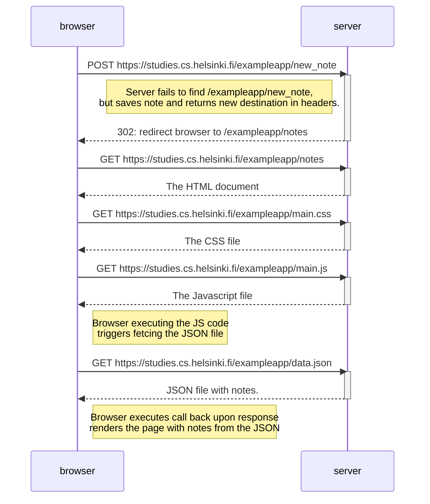
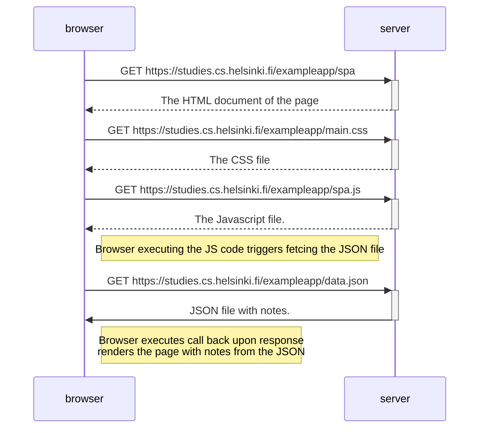
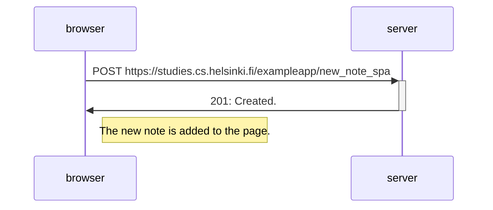

## 0.4 Uusi muistiinpano:

## 0.5 Single Page App:
User goes to the Single Page App version of the page

## 0.6: Uusi muistiinpano
User adds a new note to the Single Page App version of the page

